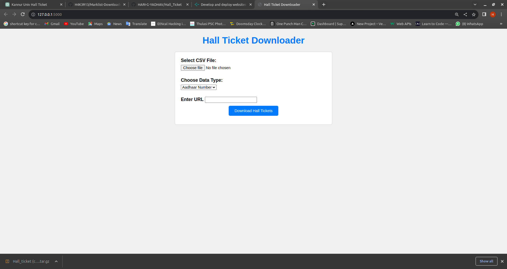

# Marklist Downloader 

Flask webapp which downloads marklist of student by provided .csv file and URL


## Authors

- [@HARI-G-YADHAV](https://www.github.com/HARI-G-YADHAV)


## Screenshots




## Tech Stack

**Client:** HTML,CSS

**Server:** FLASK,PYTHON


## Run Locally

Clone the project

```bash
  git clone https://github.com/HARI-G-YADHAV/Hall_Ticket.git
```

Go to the project directory

```bash
  cd 
```

Install Required Packages 

```bash
  pip3 install -r requirement.txt
```

Start the server in debug mode

```bash
  pip3 app.py

```


## Bugs
Only able to use in google chrome *FIXED*
